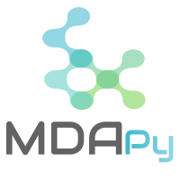

<p align="center" width="100%">
     
</p>

# MDAPy

MDAPy is a Python tool for calculating and evaluating 10 Maximum Depositional Age (MDA) methods: YSG, YC1σ, YC2σ, YDZ, MLA, YPP, YSP, Y3Za, Y3Zo, and Tau. MDAPy is available as a downloadable software package. 

---

### Installation & Setup

MDAPy runs locally via Docker, an open platform for developing and running applications in isolated containers, ensuring MDAPy runs consistently regardless of your system configuration. Docker simplifies the install process for users as it employs a container, which builds the application using the original source code, but does not require users to download Python or any required libraries.

1. Download the zip file from this GitHub page using the green **Code** button at the top
2. Unzip and place the folder somewhere easy to find, such as **Documents**
3. Download and install Docker Desktop (free — requires a free account):
   - **Newer computers:** https://docs.docker.com/desktop/
   - **Older computers (Windows):** https://docs.docker.com/desktop/previous-versions/archive-windows/
4. Open Docker Desktop, then open your **Terminal** (Mac) or **Command Prompt** (Windows)
5. Navigate to the MDAPy folder. For example:
```sh
# Mac
cd /Users/yourname/Documents/MDAPy

# Windows
cd C:\Users\yourname\Documents\MDAPy
```

Then enter the MDAPy subfolder:
```sh
cd MDAPy
```

6. Build and launch MDAPy:
```sh
# Build the Docker container — first time only, takes a few minutes
docker-compose build

# Launch MDAPy
docker-compose up
```

> **Note:** After the first build, you only need to run `docker-compose up` to launch MDAPy in future sessions.

7. Open a browser and go to: **http://localhost:8080**
   
8. For detailed usage instructions, see the [User Manual](MDAPy_User_Manual.md).

---

## Citation

If you use MDAPy in your research, please cite:

> Brooks, M. (2025). An evaluation of the accuracy of maximum depositional age algorithms 
> in a variety of tectonic settings using MDAPy: a new Python based application 
> (Master's thesis, University of Calgary, Calgary, Canada). 
> https://doi.org/10.11575/PRISM/49790

---

## Acknowledgements & Third-Party Code
MDAPy is released under the **MIT License**. Portions of the code are adapted from 
**detritalPy v1.3** (Sharman et al., 2018) under Apache 2.0, and **IsoplotR** 
(Vermeesch, 2018; 2021) under GPL. Full attribution is provided in the source code comments.

---


